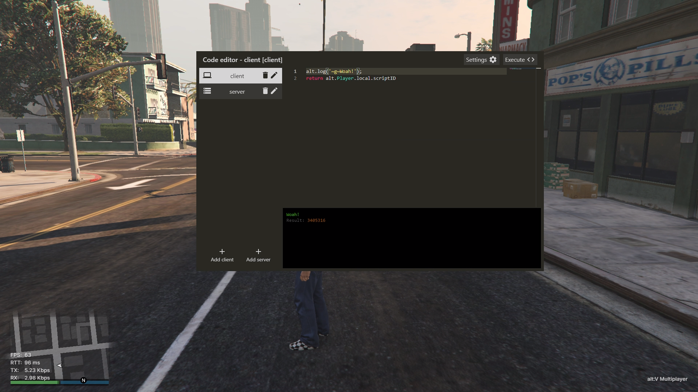
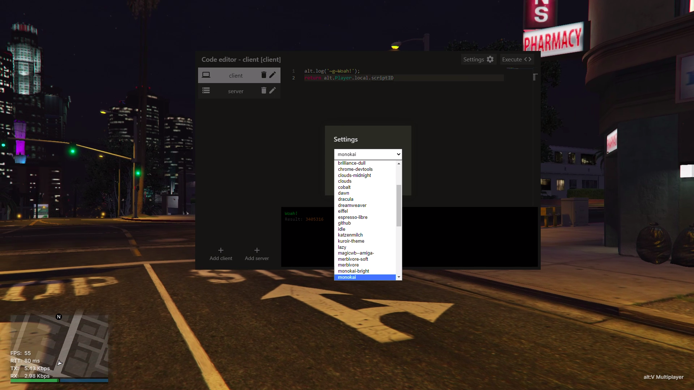
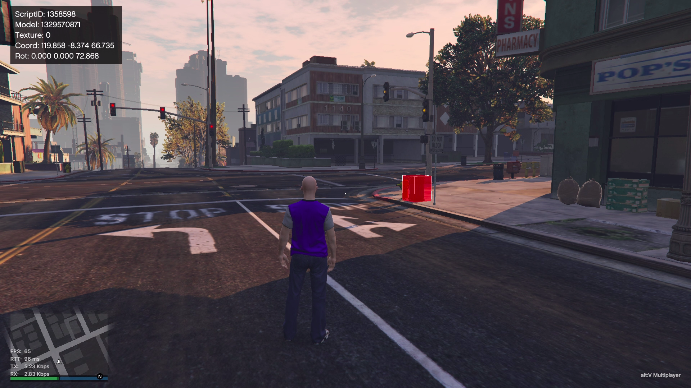

# alt:V Server developer tools

## Tools include:
- Powerful in-game code editor
- Model inspector
- Fly
- Freecam
- Teleport to the map waypoint

### Code editor

In-game code editor allows you to execute some JS code on client- or server- side directly in the game, while having autocompletion, hints, and so on.

Features:
- Resizable and movable window
- File persistence (files are saved in the local storage, so they don't reset after a reconnect/server restart)
- Autocompletion with the newest typings (dynamically downloaded from the typings repo)
- Ability to use code editor with keybinds only (Ctrl + Alt + / to see all the keybinds)
- Autocompletion snippets (Ctrl + Alt + ' to see all the autocompletion snippets)
- Allows using top level await
- Shows all code's logs (even with colors!) and the return value in the editor
- Has half-transparent mode (F5)
- Is pretty customizable, has a plenty of editor themes

### Model inspector

Model inspector allows you to get basic information about the entity

Features:
- Ability to select entity via crosshair or a cursor (F2)
- Shows model boundaries
- If the entity is alt:V Entity, shows its type and id

## Keybinds

### Global

`F2` - Toggle cursor 
`F3` - Model inspector 
`F4` - Fly 
`F5` - Code editor half-transparent mode 
`F6` - Code editor 
`F9` - Teleport to a waypoint on a map 

### Code editor

`Ctrl + Alt + N` - Create client file 
`Ctrl + Alt + B` - Create server file 
`Ctrl + Alt + D` - Delete current file 
`Ctrl + Alt + R` - Rename current file 
`Ctrl + Alt + F` - Focus editor 
`Ctrl + Alt + Arrow up` - Previous file 
`Ctrl + Alt + Arrow down` - Next file 
`F7 or Ctrl + Alt + E` - Execute code 
`Ctrl + Alt + '` - Snippets list 

## Build

1. `yarn install`
2. `yarn build`